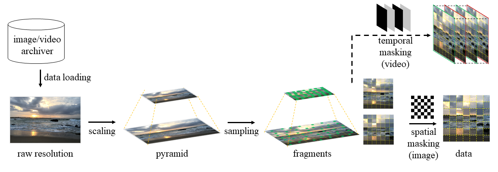

# SAMA Overview

PyTorch implementation of "**Scaling and Masking: A New Paradigm of Data Sampling for Image and Video Quality Assessment**" ([arXiv](https://arxiv.org/abs/2401.02614)), which has been accepted by **AAAI-2024**.

This code is modified from [FAST-VQA](https://github.com/VQAssessment/FAST-VQA-and-FasterVQA).



## Usage

For image quality assessment (IQA), please refer to [IQA/demo_train_iqa_baseline.py](https://github.com/Sissuire/SAMA/blob/main/IQA/demo_train_iqa_baseline.py).

For video quality assessment (VQA), please refer to [VQA/demo_train.py](https://github.com/Sissuire/SAMA/blob/main/VQA/demo_train.py) to get the training result, and refer to [VQA/demo_finetune.py](https://github.com/Sissuire/SAMA/blob/main/VQA/demo_finetune.py) to get the finetuning result. We also provide the [training log](https://github.com/Sissuire/SAMA/blob/main/VQA/log.FAST.SAMA.out) for VQA.

The main idea/contribution lies in the data sampling, which can be found in [IQA](https://github.com/Sissuire/SAMA/blob/b8fdfa390999908bf6c0da284973bb1f2eb646d8/IQA/demo_train_iqa_baseline.py#L166C13-L166C13) and [VQA](https://github.com/Sissuire/SAMA/blob/b8fdfa390999908bf6c0da284973bb1f2eb646d8/VQA/fastvqa/datasets/fusion_datasets.py#L211).

Make sure the configuration has been properly set in [fast-sama-iqa.yml](https://github.com/Sissuire/SAMA/blob/main/IQA/options/fast-sama-iqa.yml), [fast-SAMA-train.yml](https://github.com/Sissuire/SAMA/blob/main/VQA/options/fast-SAMA-train.yml) and [fast-SAMA-tinetune.yml](https://github.com/Sissuire/SAMA/blob/main/VQA/options/fast-SAMA-finetune.yml). And please prepare the pretrained models of [video-swin](https://github.com/SwinTransformer/storage/releases/download/v1.0.4/swin_tiny_patch244_window877_kinetics400_1k.pth) for VQA and [swin-v2](https://github.com/SwinTransformer/storage/releases/download/v2.0.0/swinv2_tiny_patch4_window8_256.pth) for IQA.

### Environment
Different environment may induce possible fluctuation of performance.

```
Python 3.8.10
PyTorch 1.7.0
```

The installation can refer to [FAST-VQA](https://github.com/VQAssessment/FAST-VQA-and-FasterVQA).

### Citation
If you are interested in the work, or find the code helpful, please cite our work
```
@ARTICLE{sama,  
  title={Scaling and Masking: A New Paradigm of Data Sampling for Image and Video Quality Assessment}, 
  author={Liu, Yongxu and Quan, yinghui and Xiao, guoyao and Li, Aobo and Wu, jinjian},  
  year={2024},
  eprint={2401.02614},
  archivePrefix={arXiv},
  primaryClass={cs.CV}
}
```

### Contact

Feel free to contact me via `yongxu.liu@xidian.edu.cn` if any question or bug.
